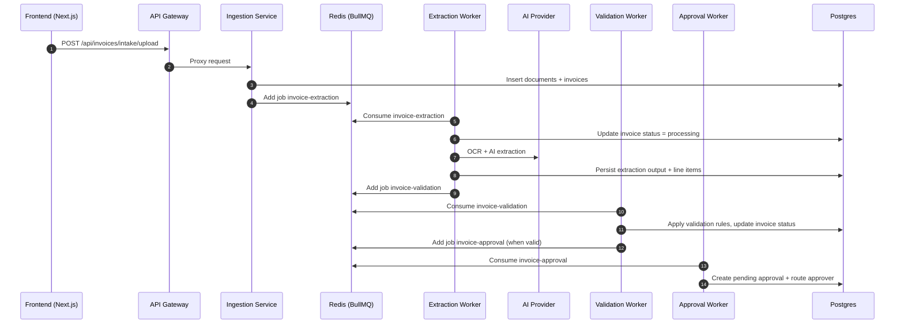
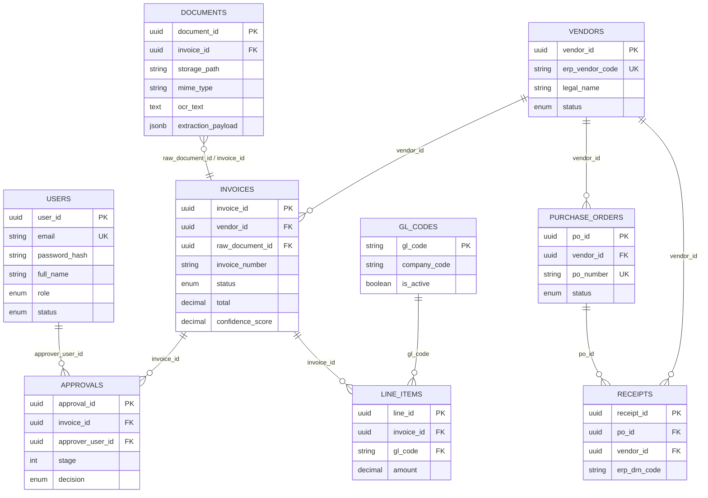

# AP_BPS - Architecture

If your diagram renderer errors when you paste this entire Markdown file (for example `UnknownDiagramError`), render the raw Mermaid sources instead:
- `docs/diagrams/complete.mmd`
- `docs/diagrams/pipeline.mmd`
- `docs/diagrams/data-model.mmd`

Draw.io (diagrams.net) file:
- `docs/diagrams/ap-bps-architecture.drawio`

## Runtime dependency note

Extraction/validation/approval are async workers driven by BullMQ (Redis). If Redis is down, jobs will not be processed.

## PDF highlighting note

For invoices uploaded as PDFs, the extraction pipeline renders page 1 as an image and sends it to the AI model so it can return `field_regions` used for UI highlights.
Set `PDF_IMAGE_PAGES` (default 1, max 10) to render more pages as images for multi-page invoices.
UI highlight boxes are intentionally shrunk slightly (configurable via `NEXT_PUBLIC_HIGHLIGHT_SHRINK`) to reduce oversized model boxes.

## Complete architecture (single diagram)

```mermaid
flowchart LR
  %% Clients
  subgraph Clients
    U[User / Browser]
    FE[Next.js Frontend\nfrontend (:3007)]
    ADM[Admin / Approver UI\n(same Frontend)]
  end

  %% Edge / entrypoint
  subgraph Edge
    GW[API Gateway\nservices/api-gateway (:3000)\nJWT auth + reverse proxy]
  end

  %% Backend services
  subgraph Services
    ING[Ingestion\nservices/ingestion-service (:3001)\n- Upload/API intake\n- Email intake\n- Invoice APIs]
    EXT[Extraction\nservices/extraction-service (:3002)\n- OCR\n- AI extraction\n- Provider selection]
    VAL[Validation\nservices/validation-service (:3003)\n- Rules engine\n- Exceptions]
    APP[Approval\nservices/approval-service (:3004)\n- Routing\n- Decisions\n- Posting status]
    ERP[ERP Sync\nservices/erp-sync-service (:3005)\n- Scheduled sync\n- Vendors/POs/GL\n- Sync logs]
    NOTIF[Notifications\nservices/notification-service (:3006)\n- Notifications API\n- (Optional) email worker]
  end

  %% Shared library
  subgraph Shared
    SH[@ap-bps/shared\npackages/shared\n- Knex (db)\n- Types\n- Logger\n- Migrations]
  end

  %% Data / infra
  subgraph Infra["Data & Infrastructure"]
    PG[(PostgreSQL\ninvoices, documents, vendors,\napprovals, line_items, ...)]
    R[(Redis\nBullMQ queues)]
    FS[(Local storage\nuploads/ + file blobs)]
    ENV[.env\nservice config + secrets]
  end

  %% External systems
  subgraph External
    IMAP[Email Server (IMAP)]
    SMTP[SMTP Server]
    AI[AI Providers\nOpenAI / Anthropic / Gemini]
    ERPAPI[ERP System / API]
  end

  %% Frontend -> gateway
  U --> FE
  ADM --> FE
  FE -->|/api/auth/* (login/register/me)| GW
  FE -->|/api/* (business APIs)| GW

  %% Gateway -> services (reverse proxy)
  GW -->|/api/invoices*\n/api/admin*| ING
  GW -->|/api/extraction*| EXT
  GW -->|/api/validation*| VAL
  GW -->|/api/approvals*| APP
  GW -->|/api/vendors*\n/api/purchase-orders*\n/api/gl-codes*\n/api/erp-sync*| ERP
  GW -->|/api/notifications*| NOTIF

  %% Shared + config
  ENV -.-> GW
  ENV -.-> ING
  ENV -.-> EXT
  ENV -.-> VAL
  ENV -.-> APP
  ENV -.-> ERP
  ENV -.-> NOTIF
  SH --- GW
  SH --- ING
  SH --- EXT
  SH --- VAL
  SH --- APP
  SH --- ERP
  SH --- NOTIF

  %% Persistence
  SH --> PG
  ING --> FS
  EXT --> FS

  %% Email intake (optional)
  IMAP -->|poll + attachments| ING

  %% Async pipeline (BullMQ)
  ING -->|enqueue: invoice-extraction| R
  R -->|worker: invoice-extraction| EXT
  EXT -->|enqueue: invoice-validation| R
  R -->|worker: invoice-validation| VAL
  VAL -->|enqueue: invoice-approval| R
  R -->|worker: invoice-approval| APP

  %% AI + ERP integrations
  EXT --> AI
  ERP -->|fetch master data| ERPAPI

  %% Notifications (optional)
  NOTIF -.->|optional enqueue: notifications| R
  R -.->|worker: notifications| SMTP
```

## System / container view (simplified)

```mermaid
flowchart LR
  %% ---------- Clients ----------
  subgraph Clients
    U[User / Browser]
    FE[Next.js Frontend\n(frontend, :3007)]
  end

  %% ---------- Edge ----------
  subgraph Edge
    GW[API Gateway\n(Express, services/api-gateway, :3000)\nJWT auth + reverse proxy]
  end

  %% ---------- Core Services ----------
  subgraph Services
    ING[Ingestion Service\n(services/ingestion-service, :3001)\nUpload + Email intake]
    EXT[Extraction Service\n(services/extraction-service, :3002)\nOCR + AI extraction]
    VAL[Validation Service\n(services/validation-service, :3003)\nBusiness rules]
    APP[Approval Service\n(services/approval-service, :3004)\nApproval workflow]
    ERP[ERP Sync Service\n(services/erp-sync-service, :3005)\nERP master-data sync + trigger]
    NOTIF[Notification Service\n(services/notification-service, :3006)\nNotifications API]
  end

  %% ---------- Data / Infra ----------
  subgraph Data["Data & Infrastructure"]
    PG[(PostgreSQL\npackages/shared: Knex + migrations)]
    R[(Redis\nBullMQ queues)]
    FS[(Local storage\nuploads/ + document blobs)]
  end

  %% ---------- External ----------
  subgraph External
    IMAP[Email Server\n(IMAP)]
    SMTP[SMTP Server]
    AI[AI Providers\nOpenAI / Anthropic / Gemini]
    ERPAPI[ERP System / API]
  end

  %% ---------- Primary synchronous path ----------
  U --> FE
  FE -->|HTTPS| GW
  GW -->|/api/invoices*| ING
  GW -->|/api/extraction*| EXT
  GW -->|/api/validation*| VAL
  GW -->|/api/approvals*| APP
  GW -->|/api/vendors /purchase-orders /gl-codes /erp-sync*| ERP
  GW -->|/api/notifications*| NOTIF

  %% ---------- Ingestion ----------
  IMAP -->|poll attachments| ING
  ING --> PG
  ING --> FS
  ING -->|enqueue: invoice-extraction| R

  %% ---------- Extraction ----------
  R -->|Worker: invoice-extraction| EXT
  EXT --> PG
  EXT --> FS
  EXT --> AI
  EXT -->|enqueue: invoice-validation| R

  %% ---------- Validation ----------
  R -->|Worker: invoice-validation| VAL
  VAL --> PG
  VAL -->|enqueue: invoice-approval| R

  %% ---------- Approval ----------
  R -->|Worker: invoice-approval| APP
  APP --> PG

  %% ---------- ERP sync ----------
  ERP --> PG
  ERP -->|fetch master data| ERPAPI

  %% ---------- Notifications (optional) ----------
  NOTIF --> PG
  NOTIF -.->|BullMQ worker exists\n(queue: notifications)| R
  R -.->|Worker: notifications| SMTP
```

## Invoice processing pipeline (async detail)



## Data model (Postgres)


